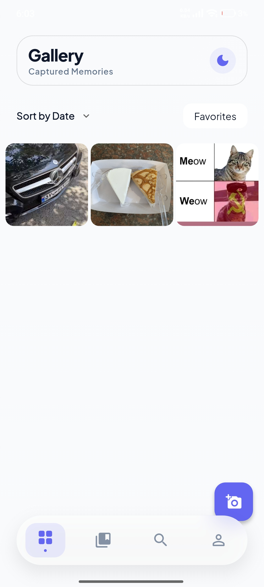
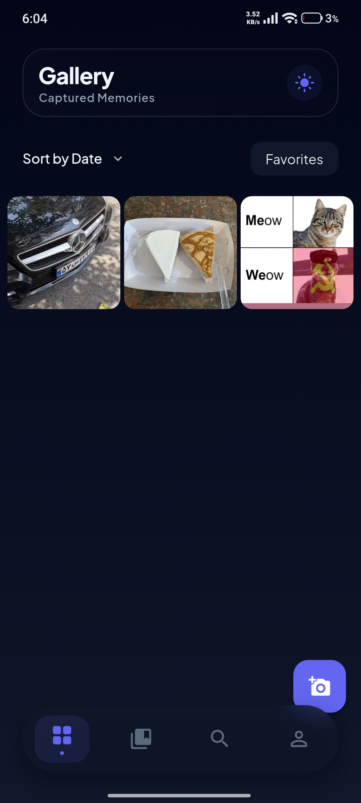
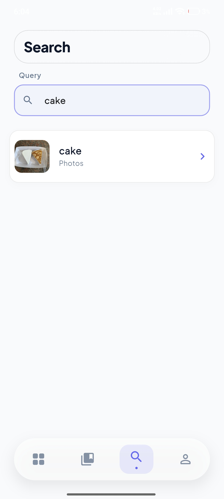
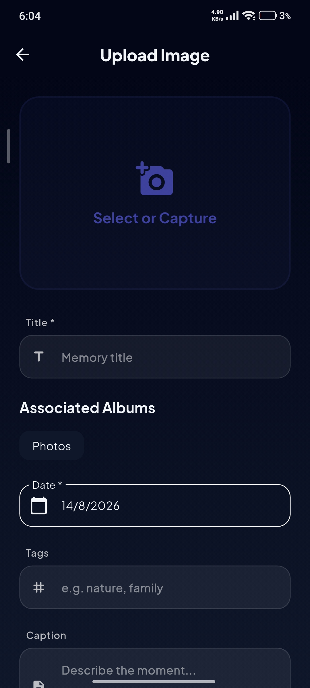
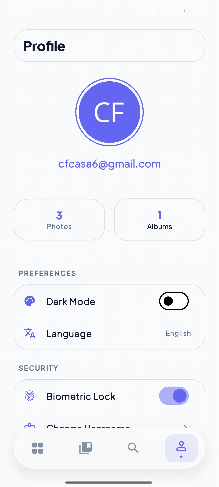

📸 AP_Project

An online Gallery / Photo Album application built using a Client–Server architecture.

The application consists of a Flutter frontend and a multi-threaded Java backend. Users can create albums, upload images, browse public photos, search content, like and comment on images, and manage their profiles.

---

📱 Screenshots

<p align="center">
  
  
  
</p><p align="center">
  <b>Light Mode</b>
  &nbsp;&nbsp;&nbsp;&nbsp;&nbsp;&nbsp;
  <b>Dark Mode</b>
  &nbsp;&nbsp;&nbsp;&nbsp;&nbsp;&nbsp;
  <b>Search</b>
</p><p align="center">
  
  
</p><p align="center">
  <b>Upload</b>
  &nbsp;&nbsp;&nbsp;&nbsp;&nbsp;&nbsp;&nbsp;&nbsp;
  <b>Profile</b>
</p>---

✨ Features

- 🔐 User registration and authentication
- 🖼️ Public image gallery
- 📁 Album creation and management
- ⬆️ Image uploading
- 🔍 Search for images and albums
- ❤️ Like images
- 💬 Comment on images
- 🚫 Enable or disable comments for images
- 👤 User profile management
- 🎨 Dynamic light and dark themes
- 🔌 Client–server communication using raw TCP sockets
- 🧵 Multi-threaded Java server
- 📦 JSON-based communication protocol

---

🏗️ Architecture

The project follows a Client–Server architecture.

┌─────────────────────────┐
│      Flutter Client     │
│         (Dart)          │
│                         │
│  UI + Provider +        │
│  SocketService          │
└────────────┬────────────┘
             │
             │ TCP Socket
             │ Line-delimited JSON
             │
             ▼
┌─────────────────────────┐
│      Java Backend       │
│                         │
│   Multi-threaded Server │
│                         │
│ Controllers / Handlers  │
│ Database / Storage      │
└─────────────────────────┘

Technologies

Component| Technology
Frontend| Flutter / Dart
Backend| Java
Communication| TCP Socket
Data Format| JSON
State Management| Provider
JSON Serialization| Gson
Server Architecture| Multi-threaded
Default Port| "5000"

---

🏗️ Project Structure

Frontend — Flutter

lib/
├── main.dart                     # Entry point, Provider initialization, authentication check
├── models/                       # Data models
│
├── pages/
│   ├── login_page.dart
│   ├── register_page.dart
│   ├── gallery_page.dart
│   ├── albums_page.dart
│   ├── albums_overview_page.dart
│   ├── album_details_page.dart
│   ├── photo_details_page.dart
│   ├── profile_page.dart
│   ├── search_page.dart
│   ├── upload_page.dart
│   ├── camera_or_local_page.dart
│   ├── test_connection_page.dart
│   └── main_scaffold.dart
│
├── providers/
│   ├── auth_provider.dart
│   └── gallery_provider.dart
│
├── services/
│   ├── socket_service.dart
│   ├── auth_service.dart
│   └── local_auth_service.dart
│
├── themes/
│   ├── app_theme.dart
│   └── theme_provider.dart
│
└── widgets/
    ├── custom_text_field.dart
    ├── glass_container.dart
    ├── photo_image.dart
    └── pressable.dart

---

Backend — Java

src/main/java/
├── server/
│   ├── Server.java               # Main server
│   ├── ClientHandler.java        # Handles each client connection
│   ├── Request.java              # JSON request model
│   └── Response.java             # JSON response model
│
├── handlers/
│   ├── UserController.java
│   ├── AlbumController.java
│   └── GalleryController.java
│
├── database/
│   ├── UserDatabase.java
│   └── ImageStorage.java
│
├── models/
│   └── ...                       # User, Admin, Album, Image, Comment
│
└── admin/
    └── AdminPanel.java

---

🔌 Communication Protocol

The application communicates through a raw TCP socket using line-delimited JSON.

Each request and response is sent as a single JSON object followed by a newline ("\n").

Client Request

{
  "method": "GET|POST|PUT|DELETE",
  "username": "current_user",
  "route": "/path/to/endpoint",
  "payload": {
    ...
  }
}

Server Response

{
  "statusCode": 200,
  "message": "Success message",
  "payload": {
    ...
  }
}

Status Codes

Code| Description
"200"| Request successful
"400"| Invalid request or malformed JSON
"401"| Authentication failed
"404"| Route not found

---

🚀 API Endpoints

🔐 Authentication

Public routes that do not require authentication.

Method| Route| Description
"POST"| "/user/signup/"| Register a new user
"POST"| "/user/login/"| User login

---

👤 User Management

Authenticated routes.

Method| Route| Description
"PUT"| "/user/changeUsername/"| Change username
"PUT"| "/user/changePassword/"| Change password
"DELETE"| "/user/deleteAccount/"| Delete account

---

📁 Album Management

Method| Route| Description
"POST"| "/album/create/"| Create a new album
"GET"| "/album/list/"| List user's albums
"POST"| "/album/upload/"| Upload an image
"GET"| "/album/getImage/"| Retrieve an image
"PUT"| "/album/addImageToAlbum/"| Add an image to an album
"PUT"| "/album/removeImageFromAlbum/"| Remove an image from an album
"DELETE"| "/album/delete/"| Delete an album
"PUT"| "/album/rename/"| Rename an album

---

🖼️ Image Management

Method| Route| Description
"DELETE"| "/image/delete/"| Delete an image
"PUT"| "/image/like/"| Like an image
"POST"| "/image/comment/add/"| Add a comment
"PUT"| "/image/commentable/set/"| Enable or disable comments

---

🌐 Gallery

Method| Route| Description
"GET"| "/gallery/list/"| Retrieve all public images

---

❤️ Health Check

Method| Route| Response
"GET"| "/ping"| "{"statusCode":200,"message":"pong","payload":null}"

---

⚙️ Getting Started

Prerequisites

Make sure the following are installed:

- Flutter SDK
- Dart SDK
- Java JDK
- Git

---

1. Start the Backend

Navigate to the backend source directory:

cd src

Compile the server:

javac -d bin src/main/java/server/Server.java

Run the server:

java -cp bin server.Server

The server starts listening on:

Port: 5000

---

2. Configure the Server IP

The Flutter client connects to the backend through "SocketService".

The server IP address is configured in:

socket_service.dart

The default IP address is:

192.168.1.54

Change this address if your backend is running on another machine or IP.

«Note: Make sure the Flutter client and Java server can communicate over the network.»

---

3. Run the Flutter Application

Install the Flutter dependencies:

flutter pub get

Run the application:

flutter run

---

🔐 Authentication

Every authenticated request must include a valid "username".

The server validates the username against the "UserDatabase".

If the user does not exist, the server returns:

{
  "statusCode": 401,
  "message": "You should enter first",
  "payload": null
}

---

📦 Dependencies

Flutter

The project uses:

- "provider"
- "dart:io"
- "dart:async"
- "dart:convert"

Java

The backend uses:

- Gson ("com.google.gson") for JSON serialization and deserialization.

---

📝 Development Notes

- The backend uses a multi-threaded server architecture.
- Each client connection is handled by its own thread.
- Communication is implemented using raw TCP sockets, not HTTP.
- Requests are sent sequentially through "SocketService".
- JSON is used as the communication format between the client and server.
- Application state is managed using Provider.
- The application supports dynamic light and dark themes.
- Images are managed through the backend's "ImageStorage".
- User information is managed through "UserDatabase".

---

📱 Application Pages

Page| Description
Login| User authentication
Register| New user registration
Gallery| Browse public images
Albums| Album management
Album Details| View album contents
Photo Details| View image, likes, and comments
Profile| User profile
Search| Search images and albums
Upload| Upload images
Camera or Local| Choose an image source
Test Connection| Verify server connectivity

---

📌 Project Highlights

This project demonstrates practical experience with:

- Client–Server architecture
- TCP socket programming
- Multi-threaded programming in Java
- JSON serialization and deserialization
- Flutter application development
- State management with Provider
- User authentication
- Image and file management
- CRUD operations
- Network communication
- Modular software architecture

---

📄 License

This project is licensed under the MIT License.  &nbsp;&nbsp;&nbsp;&nbsp;&nbsp;&nbsp;
  <b>Search</b>
</p><p align="center">
  
  
</p><p align="center">
  <b>Upload</b>
  &nbsp;&nbsp;&nbsp;&nbsp;&nbsp;&nbsp;&nbsp;&nbsp;
  <b>Profile</b>
</p>---

✨ Features

- 🔐 User registration and authentication
- 🖼️ Public image gallery
- 📁 Album creation and management
- ⬆️ Image uploading
- 🔍 Search for images and albums
- ❤️ Like images
- 💬 Comment on images
- 🚫 Enable / disable comments for images
- 👤 User profile management
- 🎨 Dynamic light and dark themes
- 🔌 Client–server communication through raw TCP sockets
- 🧵 Multi-threaded Java server
- 📦 JSON-based communication protocol

---

🏗️ Architecture

The project follows a Client–Server architecture:

┌─────────────────────────┐
│      Flutter Client     │
│       (Dart)            │
│                         │
│  UI + Provider +        │
│  SocketService          │
└────────────┬────────────┘
             │
             │ TCP Socket
             │ Line-delimited JSON
             │
             ▼
┌─────────────────────────┐
│     Java Backend        │
│                         │
│   Multi-threaded Server │
│                         │
│  Controllers / Handlers │
│  Database / Storage     │
└─────────────────────────┘

Technologies

Component| Technology
Frontend| Flutter / Dart
Backend| Java
Communication| TCP Socket
Data Format| JSON
State Management| Provider
JSON Serialization| Gson
Server Architecture| Multi-threaded
Default Port| "5000"

---

🏗️ Project Structure

Frontend — Flutter

lib/
├── main.dart                     # Entry point, Provider initialization, authentication check
├── models/                       # Data models
│   ├── user.dart
│   ├── album.dart
│   ├── image.dart
│   └── comment.dart
│
├── pages/
│   ├── login_page.dart
│   ├── register_page.dart
│   ├── gallery_page.dart
│   ├── albums_page.dart
│   ├── albums_overview_page.dart
│   ├── album_details_page.dart
│   ├── photo_details_page.dart
│   ├── profile_page.dart
│   ├── search_page.dart
│   ├── upload_page.dart
│   ├── camera_or_local_page.dart
│   ├── test_connection_page.dart
│   └── main_scaffold.dart
│
├── providers/
│   ├── auth_provider.dart
│   └── gallery_provider.dart
│
├── services/
│   ├── socket_service.dart
│   ├── auth_service.dart
│   └── local_auth_service.dart
│
├── themes/
│   ├── app_theme.dart
│   └── theme_provider.dart
│
└── widgets/
    ├── custom_text_field.dart
    ├── glass_container.dart
    ├── photo_image.dart
    └── pressable.dart

---

Backend — Java

src/main/java/
├── server/
│   ├── Server.java               # Main server
│   ├── ClientHandler.java        # Handles each client connection
│   ├── Request.java              # JSON request model
│   └── Response.java             # JSON response model
│
├── handlers/
│   ├── UserController.java
│   ├── AlbumController.java
│   └── GalleryController.java
│
├── database/
│   ├── UserDatabase.java
│   └── ImageStorage.java
│
├── models/
│   └── ...                       # User, Admin, Album, Image, Comment
│
└── admin/
    └── AdminPanel.java

---

🔌 Communication Protocol

The application communicates through a raw TCP socket using line-delimited JSON.

Each request and response is sent as a single JSON object followed by a newline ("\n").

Client Request

{
  "method": "GET|POST|PUT|DELETE",
  "username": "current_user",
  "route": "/path/to/endpoint",
  "payload": {
    ...
  }
}

Server Response

{
  "statusCode": 200,
  "message": "Success message",
  "payload": {
    ...
  }
}

Status Codes

Code| Description
"200"| Request successful
"400"| Invalid request or malformed JSON
"401"| Authentication failed
"404"| Route not found

---

🚀 API Endpoints

Authentication

Public routes that do not require authentication.

Method| Route| Description
"POST"| "/user/signup/"| Register a new user
"POST"| "/user/login/"| User login

---

User Management

Authenticated routes.

Method| Route| Description
"PUT"| "/user/changeUsername/"| Change username
"PUT"| "/user/changePassword/"| Change password
"DELETE"| "/user/deleteAccount/"| Delete account

---

Album Management

Method| Route| Description
"POST"| "/album/create/"| Create a new album
"GET"| "/album/list/"| List user's albums
"POST"| "/album/upload/"| Upload an image
"GET"| "/album/getImage/"| Retrieve an image
"PUT"| "/album/addImageToAlbum/"| Add image to an album
"PUT"| "/album/removeImageFromAlbum/"| Remove image from an album
"DELETE"| "/album/delete/"| Delete an album
"PUT"| "/album/rename/"| Rename an album

---

Image Management

Method| Route| Description
"DELETE"| "/image/delete/"| Delete an image
"PUT"| "/image/like/"| Like an image
"POST"| "/image/comment/add/"| Add a comment
"PUT"| "/image/commentable/set/"| Enable / disable comments

---

Gallery

Method| Route| Description
"GET"| "/gallery/list/"| Retrieve all public images

---

Health Check

Method| Route| Response
"GET"| "/ping"| "{"statusCode":200,"message":"pong","payload":null}"

---

⚙️ Getting Started

Prerequisites

Make sure the following are installed:

- Flutter SDK
- Dart SDK
- Java JDK
- Git

---

1. Start the Backend

Navigate to the backend source directory:

cd src

Compile the server:

javac -d bin src/main/java/server/Server.java

Run the server:

java -cp bin server.Server

The server listens on:

Port: 5000

---

2. Configure the Server IP

The Flutter client connects to the backend through "SocketService".

The server IP address is configured in:

socket_service.dart

The default configuration is:

192.168.1.54

If the backend is running on another machine, change the IP address accordingly.

«Make sure the client and server can communicate with each other over the network.»

---

3. Run the Flutter Application

Install dependencies:

flutter pub get

Run the application:

flutter run

---

🔐 Authentication

Authenticated requests require a valid "username".

The server validates the username against the "UserDatabase".

If the user does not exist, the server returns:

{
  "statusCode": 401,
  "message": "You should enter first",
  "payload": null
}

---

📦 Dependencies

Flutter

The main Flutter dependencies and APIs used by the application include:

- "provider"
- "dart:io"
- "dart:async"
- "dart:convert"

Java

The backend uses:

- Gson — JSON serialization and deserialization

---

📝 Development Notes

- The backend uses a multi-threaded server architecture.
- Each client connection is handled by its own thread.
- Communication is implemented using raw TCP sockets, not HTTP.
- Requests are exchanged sequentially through "SocketService".
- JSON is used as the communication format between client and server.
- Application state is managed using Provider.
- The application supports dynamic light and dark themes.
- Images are managed by the backend's "ImageStorage".
- User information is managed through "UserDatabase".

---

📱 Application Pages

Page| Description
Login| User authentication
Register| New user registration
Gallery| Browse public images
Albums| Album management
Album Details| View album contents
Photo Details| View image, likes, and comments
Profile| User profile
Search| Search images and albums
Upload| Upload images
Camera or Local| Choose an image source
Test Connection| Verify server connectivity

---

📌 Project Highlights

This project demonstrates several important concepts:

- Client–Server architecture
- TCP socket programming
- Multi-threaded programming in Java
- JSON serialization and deserialization
- Flutter application development
- State management with Provider
- User authentication
- File and image management
- CRUD operations
- Network communication
- Modular software architecture

---

📄 License

This project is licensed under the MIT License.│   ├── albums_page.dart
│   ├── albums_overview_page.dart
│   ├── album_details_page.dart
│   ├── photo_details_page.dart
│   ├── profile_page.dart
│   ├── search_page.dart
│   ├── upload_page.dart
│   ├── camera_or_local_page.dart
│   ├── test_connection_page.dart
│   └── main_scaffold.dart
├── providers/                    # State management using Provider
│   ├── auth_provider.dart
│   └── gallery_provider.dart
├── services/                     # Socket communication & authentication
│   ├── socket_service.dart
│   ├── auth_service.dart
│   └── local_auth_service.dart
├── themes/
│   ├── app_theme.dart
│   └── theme_provider.dart
└── widgets/
    ├── custom_text_field.dart
    ├── glass_container.dart
    ├── photo_image.dart
    └── pressable.dart
```

---

## Backend (Java)

```
src/main/java/
├── server/
│   ├── Server.java               # Main server (Port 5000, multi-threaded)
│   ├── ClientHandler.java        # Handles each client connection
│   ├── Request.java              # JSON request model
│   └── Response.java             # JSON response model
├── handlers/
│   ├── UserController.java
│   ├── AlbumController.java
│   └── GalleryController.java
├── database/
│   ├── UserDatabase.java
│   └── ImageStorage.java
├── models/                       # User, Admin, Album, Image, Comment models
└── admin/
    └── AdminPanel.java
```

---

# 🔌 Communication Protocol

The application communicates through a **raw TCP socket** using **JSON messages**, where each request and response is sent as **a single JSON object followed by a newline (`\n`)**.

---

## Client Request Format

```json
{
  "method": "GET|POST|PUT|DELETE",
  "username": "current_user",
  "route": "/path/to/endpoint",
  "payload": {
    ...
  }
}
```

---

## Server Response Format

```json
{
  "statusCode": 200,
  "message": "Success message",
  "payload": {
    ...
  }
}
```

### Status Codes

| Code | Description |
|------|-------------|
| 200 | Success |
| 400 | Invalid request or malformed JSON |
| 401 | Authentication failed |
| 404 | Route not found |

---

# 🚀 Features

## Authentication (Public Routes)

| Method | Route | Description |
|---------|-------|-------------|
| POST | `/user/signup/` | Register a new user |
| POST | `/user/login/` | User login |

---

## User Management (Authenticated)

| Method | Route |
|---------|------|
| PUT | `/user/changeUsername/` |
| PUT | `/user/changePassword/` |
| DELETE | `/user/deleteAccount/` |

---

## Album Management (Authenticated)

| Method | Route | Description |
|---------|-------|-------------|
| POST | `/album/create/` | Create a new album |
| GET | `/album/list/` | List user's albums |
| POST | `/album/upload/` | Upload an image |
| GET | `/album/getImage/` | Retrieve an image |
| PUT | `/album/addImageToAlbum/` | Add image to album |
| PUT | `/album/removeImageFromAlbum/` | Remove image from album |
| DELETE | `/album/delete/` | Delete an album |
| PUT | `/album/rename/` | Rename an album |

---

## Image Management (Authenticated)

| Method | Route |
|---------|------|
| DELETE | `/image/delete/` |
| PUT | `/image/like/` |
| POST | `/image/comment/add/` |
| PUT | `/image/commentable/set/` |

---

## Gallery

| Method | Route | Description |
|---------|-------|-------------|
| GET | `/gallery/list/` | Retrieve all public images |

---

## Health Check

| Method | Route | Response |
|---------|-------|----------|
| GET | `/ping` | `{"statusCode":200,"message":"pong","payload":null}` |

---

# ⚙️ Getting Started

## Backend (Java)

Compile and run the server:

```bash
cd src

javac -d bin src/main/java/server/Server.java

java -cp bin server.Server
```

The server starts listening on **port 5000**.

---

## Frontend (Flutter)

```bash
flutter pub get

flutter run
```

> **Note:**  
> The server IP address is configured in **`socket_service.dart`** (around line 16).  
> The default value is:

```text
192.168.1.54
```

Change it if your backend is running on another machine or IP.

---

# 🔐 Authentication

Every authenticated request must include a valid `username`.

The server validates the username against the `UserDatabase`.

If the user does not exist, the server returns:

```json
{
  "statusCode": 401,
  "message": "You should enter first",
  "payload": null
}
```

---

# 📦 Dependencies

## Flutter

- provider
- dart:io
- dart:async
- dart:convert

---

## Java

- Gson (`com.google.gson`) for JSON serialization/deserialization

---

# 📝 Development Notes

- Multi-threaded server architecture.
- Each client connection is handled in its own thread.
- Uses **raw TCP sockets**, not HTTP.
- Requests are sent sequentially through `SocketService`.
- Application state is managed with **Provider**.
- Supports dynamic theme switching.

---

# 🎨 Application Pages

| Page | Description |
|------|-------------|
| Login | User authentication |
| Register | New user registration |
| Gallery | Browse public images |
| Albums | Album management |
| Album Details | View album contents |
| Photo Details | View image, likes, and comments |
| Profile | User profile |
| Search | Search images/albums |
| Upload | Upload images |
| Camera or Local | Choose image source |
| Test Connection | Verify server connectivity |

---

# 📄 License

This project is licensed under the **MIT License**.
